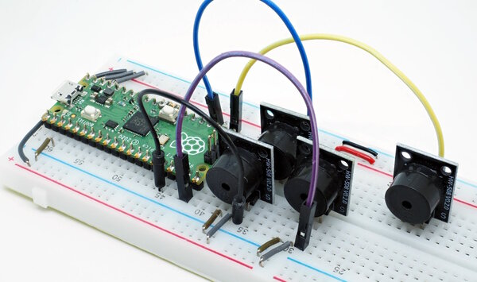
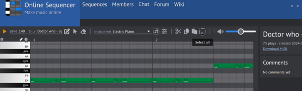

Asyncio-based Library for Buzzer-Music (CircuitPython)
======================================================

Introduction
------------

You can play simple melodies on a single or multiple passive buzzers
using PWM. While the task of playing a simple tone is trivial (set the
frequency and then the duty cycle on a PWM pin for the tone-duration),
playing complete melodies is more challenging.

This repository provides some building blocks for playing even
complex multi-tone melodies on a set of buzzers.

The project started off as a port of the MicroPython implementation
from <https://github.com/james1236/buzzer_music>, but ended up as a
complete new implementation makeing heavy use of asyncio.

Installation
------------

The recommended way of installation is to use circup:

    circup install -r requirements.txt

For a manual installation, copy the `buzzer_music` directory to your
`lib` directory of your device and install `adafruit_ticks` and
`adafruit_asyncio`.

Usage
-----

The basic building block is the class `AsyncBuzzer`. This class can be
used directly and it is also used by higher level abstractions from
the library. See the examples `simple_buzzer.py`, `poly_buzzer.py` and
`monophonic.py` in the `examples`-directory.

The library also provides the class `MusicPlayer` which allows to play
complete works loading notes as necessary from a file:

    async def main():
      player = MusicPlayer(pins=[board.GP18,board.GP17,
                                 board.GP15,board.GP13],debug=True)
      # from: https://onlinesequencer.net/2244697
      # needs four buzzers
      print("playing 'Bach Prelude Nr.1 C-Major' at 80 bpm ...")
      await player.play(filename="music/bach-prelude-C-Dur-4B.txt")
      player.deinit()

    asyncio.run(main())

The complete example is in `examples/simple_player.py`.

Notation
--------

The `MusicPlayer` class expects the notes in a string or file in the
notation `start pitch duration instrument; ...`, e.g.:

    song="4 D6 4 41;8 C6 4 41;12 F6 4 41;16 E6 8 41;..."

In a file, there must be a single note on a line and the lines must be
sorted by start:

    # "Happy Birthday"
    bpm = 110
    ref = 0.25
    4 D6 4 41
    8 C6 4 41
    12 F6 4 41
    16 E6 8 41
    ...

Comment lines starting with a '#' are ignored. The optional lines
`bpm=` and `ref=` define the beats per minute with reference (in
the example a quarter note for every beat).

The instrument-field and any other additional fields are ignored.

Onlinesequencer.net
-------------------

The notation is not arbitrary. You can find many songs on
<https://onlinesequencer.net> that are suitable for buzzers. Copying
is a bit tricky: you have to enter edit mode (pencil button) and then
select and copy all notes. Selecting all notes works either with
'CTRL-A' or with the select-all button, copying with 'CTRL-C'. Make
sure that your cursor is somewhere above the score (but don't click
into it) when using 'CTRL-A/CTRL-C'.

Once copied, insert the notes either directly into your program as a
string (works for short pieces), or paste it into a file. In the first
case, you have to remove the header (something like "Online
Sequencer:250354:") and the trailing ':' manually.

When copying the notes into a file (the filename should not end in
'.txt', otherwise there are no limitations), you just save it and then
run a preprocessor script:

    tools/preprocess-music.sh happy-birthday.raw

The example assumes that the notes were copyied into a file named
`happy-birthday.raw`. The preprocessor then splits the notes and
sorts them and finally writes the notes to `happy-birthday.txt`.

Implementation Notes
--------------------

The player uses two async-tasks: one for reading notes and one for
dispatching them to the buzzers. A third task does garbage-collection
at a given interval.  The reader and dispatcher tasks communicate
using a double-ended queue (deque).

CircuitPython has an optimzed, dedicated class for deques in
`collections.deque`, but that class seems to have problems. This is
the reason that this library uses a simple list instead, replacing
`deque.appendleft(x)` with the less efficient
`list.insert(0,x)`. Since the implementation limits the queue-size,
the performance penalty is small.

Asyncio relies on cooperative routines. This is important for music,
since the tone-durations and intervals should be as exact as
possible. Since the quality of music played on buzzers is very low
anyways, the implementation via asyncio is good enough in most
cases. Running `MusicPlayer.play(...,debug=True)` will output
timings. Some tests with a Pico and four buzzers show that it is no
problem to play 200-300 notes per minute without problems. Timing offsets
are in the range of a few milliseconds.

When using this library together with other code (e.g. LED-animations),
take care not to block processing with long running tasks.

Tips and Tricks
---------------

Some random notes:

  - Not every buzzer sounds the same, some are better than others.
  - The frequency range of buzzers is limited. Very low frequencies tend to
    sum, high frequencies tend to peep.
  - `MusicPlayer` fails in dispatching notes if there are more notes than
    buzzers for a given timepoint. This is no problem if notes only overlap
    due to rounding effects, but it just does not work to play a melody and
    a full chord on only four buzzers. The constructor of `MusicPlayer` has
    a parameter `skip=False`. Setting `skip=True` will skip notes if all
    buzzers are busy (usually an inferior choice).
  - Onlinesequencer.net often provides multiple versions of a song. Simpler
    versions tend to sound better than complex, fat versions.
  - Be aware of copyright issues when copying music.
